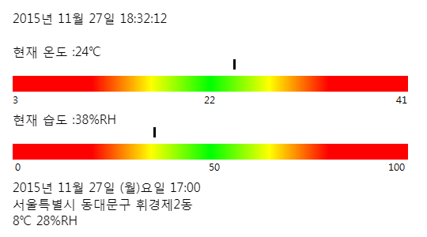

# Temperatur and humidity sensor with Arduino

## 배경

2014년 6월경 연구실의 서버실 항온항습기가 고장났다. 서버실에는 벽걸이형 온도계와 CCTV만 있어서 실시간으로 모니터링을 해야 이상을 감지할 수 있었다. 서버실의 온도가 급격하게 상승하였으나 몇시간이 지나서야 고장이 발견되었다. 서버실의 온도는 50도 가까이 치솟았고, 라우터가 하나 고장나 몇주간 서버이용에 지장을 주었다. 따라서 문제의 재발방지를 위해 아두이노와 온습도센서(DHT22)로 실시간 온습도 감시장비를 만들었다.

## 기능

아두이노와 온습도센서가 실시간으로 온습도를 측정하여 2초마다 PC로 전송한다. 따라서 아두이노에 arduino_src의 파일을 넣어서 실행시킨다.

input.py를 실행시키면 아두이노에서 전송된 온도, 습도를 data.xml 파일로 D드라이브에 저장시킨다.

information.html는 자바스크립트로 xml 파일을 읽어 현재 시간, 온도, 습도를 읽고 이를 웹페이지에 출력한다. 또한 실시간으로 비교하기 위해 기상청 웹쿼리로부터 서버가 위치한 휘경동의 날씨를 받아와 아래 표시하였다. 서버실과 외부온도를 비교할 수 있다.

이 프로그램은 실시간 감시를 위한 것이므로 실시간 데이터만 저장한다. 필요에 따라 주기적인 데이터를 모아, 서버의 사용량에 따른 서버실의 온도나 외부 기온에 의한 서버실 온도의 영향 등을 확인할 수도 있을 것이다. 

## License

© Youngcheor Ra